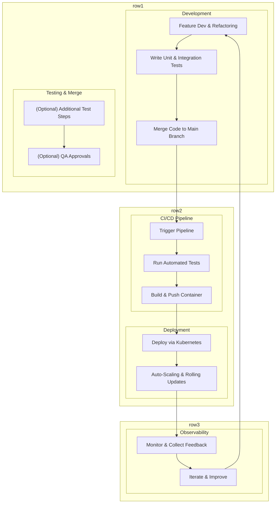

##  **Modern Industrial Software Development Process**

_This document describes a typical workflow in modern software development, especially for systems composed of multiple microservices integrated into a larger application. It covers code development, testing, CI/CD pipelines, and deployment via container orchestration._

**1. Microservices Architecture**

• **Modular Services:**

Each microservice is responsible for a specific function (e.g., authentication, payments, business logic).

• **Front-end Integration:**

A central front-end service integrates data from various microservices.

• **Independent Deployment:**

Each service can be developed, tested, and deployed independently.

**2. Code Development & Contribution**

• **Feature Development & Refactoring:**

Engineers work on new features and refactor existing code for better performance and maintainability.

• **Test Coverage:**

• **Unit Tests:** Validate individual functions and components.

• **Integration Tests:** Ensure that different parts of the system work together as expected.

• **Version Control:**

All changes are merged into a central codebase using Git or similar systems.

**3. Continuous Integration / Continuous Deployment (CI/CD)**

• **Automated Testing:**

CI/CD pipelines are triggered when code is merged:

• **Run Unit & Integration Tests:** Validate that the new code doesn’t break existing functionality.

• **Static Code Analysis:** (Optional) Tools like ESLint, SonarQube, etc., check for code quality.

**4. Deployment with Kubernetes**

• **Containerization:**

Applications are containerized (e.g., using Docker).

• **Kubernetes Orchestration:**

• **Auto-Scaling:** Kubernetes automatically scales pods based on demand.

• **Rolling Updates:** Code updates are deployed gradually, ensuring high availability.

• **Deployment Flow:**

1. **Code Merge:** Changes pushed to the main branch trigger CI/CD pipelines.

2. **Testing:** Automated tests are run.

3. **Build:** Container images are built and pushed to a registry.

4. **Deploy:** Kubernetes uses deployment configurations to update services.

**5. Monitoring & Feedback**

• **Real-Time Monitoring:**

Tools like Prometheus and Grafana track performance, errors, and resource usage.

• **Alerts & Logs:**

CI/CD systems and Kubernetes provide logs and alerts for troubleshooting and performance tuning.

